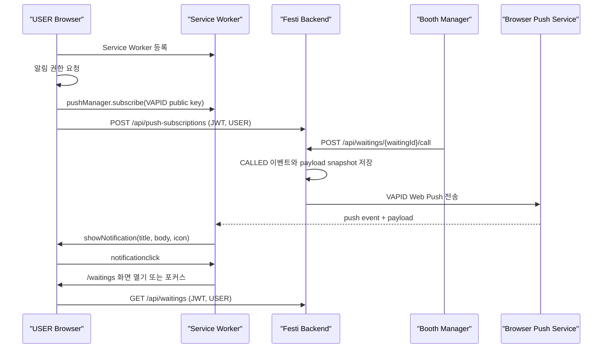

# Frontend Push Notification Integration Guide

이 문서는 프론트엔드가 현재 Festi Backend의 웨이팅 Push 알림 구현과 일치하도록 Web Push를 연동하기 위한 기준 문서이다.

- 기준 코드: `feat/booth-waitings` 브랜치의 현재 구현
- 기준일: 2026-05-25
- 연관 문서: `docs/FRONTEND_API_CONTEXT.md`, `docs/IMPLEMENTATION_PLAN.md`

## 1. Current Scope

현재 Push 알림은 사용자가 등록한 웨이팅이 운영자에 의해 호출되었을 때 사용자 브라우저로 안내 알림을 보내는 용도로만 사용된다.

| 항목 | 현재 동작 |
| --- | --- |
| 구독 등록/삭제 사용자 | JWT 인증된 `USER` |
| 알림 발생 조건 | 운영자가 `POST /api/waitings/{waitingId}/call`을 호출하거나 재호출 |
| 알림 이벤트 타입 | `CALLED` |
| 알림 클릭 이동 경로 | `/waitings` |
| 사용자 대기열 상태 확인 | 알림 클릭 후 `GET /api/waitings`로 최신 상태 조회 |

현재 백엔드는 다음 기능을 제공하지 않는다.

- VAPID 공개키 조회 API
- 사용자 알림 목록 또는 읽음 처리 API
- Push 전송 성공/실패 내역 조회 API
- Push payload를 통한 웨이팅 상태 동기화 API

따라서 Push 알림은 상태 데이터가 아니라 사용자가 최신 웨이팅 화면을 열도록 안내하는 신호로 처리해야 한다.

## 2. End-to-End Flow



백엔드는 운영자의 호출 API 처리 중 Push 서비스로의 발송을 동기적으로 시도한다. 브라우저 Push 서비스가 이후 service worker에 실제 알림을 전달하는 과정은 브라우저와 Push 서비스가 처리한다.

## 3. API Contract

### 3.1 Push 구독 등록

| 항목 | 값 |
| --- | --- |
| Endpoint | `POST /api/push-subscriptions` |
| 인증 | Bearer JWT 필요 |
| 권한 | `USER` |
| 성공 응답 | `201 Created` |

브라우저의 `PushSubscription`에서 발급된 `endpoint`, `p256dh`, `auth`를 서버에 전달한다.

```json
{
  "endpoint": "https://push.example.com/subscription/1",
  "keys": {
    "p256dh": "browser-public-key",
    "auth": "browser-auth-secret"
  }
}
```

```json
{
  "id": "d0cdad48-2fb8-43dd-b8f5-15a24e59f9b2",
  "endpoint": "https://push.example.com/subscription/1"
}
```

요청 필드 제약은 다음과 같다.

| 필드 | 제약 |
| --- | --- |
| `endpoint` | 필수, 공백 불가, 최대 2048자 |
| `keys.p256dh` | 필수, 공백 불가, 최대 255자 |
| `keys.auth` | 필수, 공백 불가, 최대 255자 |

동일한 브라우저 Push `endpoint`를 다시 등록하면 백엔드는 신규 row를 추가하지 않고 해당 endpoint의 키와 소유 사용자를 현재 인증 사용자로 갱신한다. 로그인 사용자 변경 또는 구독 갱신 후에는 다시 등록해야 한다.

### 3.2 Push 구독 삭제

| 항목 | 값 |
| --- | --- |
| Endpoint | `DELETE /api/push-subscriptions/{subscriptionId}` |
| 인증 | Bearer JWT 필요 |
| 권한 | `USER` |
| 성공 응답 | `204 No Content` |

`subscriptionId`는 구독 등록 API 응답의 `id` 값이다. 현재 로그인 사용자가 소유하지 않은 구독 ID는 `404 RESOURCE_NOT_FOUND`로 처리된다.

### 3.3 알림 클릭 후 웨이팅 최신 상태 조회

| 항목 | 값 |
| --- | --- |
| Endpoint | `GET /api/waitings` |
| 인증 | Bearer JWT 필요 |
| 권한 | `USER` |

Push payload 자체에는 현재 웨이팅 상태 전체가 포함되지 않는다. `/waitings` 화면을 열었을 때 이 API를 호출하여 `WAITING`, `CALLED`, `CANCELED`, `SEATED` 등의 최신 상태를 렌더링해야 한다.

## 4. Push Payload Contract

운영자가 사용자의 웨이팅을 호출하면 현재 백엔드는 다음 형태의 JSON payload를 생성한다.

```json
{
  "title": "입장 안내",
  "body": "부스로 방문해 주세요.",
  "icon": "/icons/called.png",
  "url": "/waitings"
}
```

| 필드 | 현재 값의 출처 | 프론트엔드 처리 |
| --- | --- | --- |
| `title` | `push-messages.yml`의 `called.title` | 알림 제목으로 표시 |
| `body` | `push-messages.yml`의 `called.body` | 알림 본문으로 표시 |
| `icon` | `push-messages.yml`의 `called.icon` | 알림 아이콘으로 표시 |
| `url` | 백엔드 코드의 고정값 `/waitings` | 알림 클릭 시 이동 경로로 사용 |

### Route And Asset Requirements

- 프론트엔드 라우터는 `/waitings`를 사용자 웨이팅 화면으로 제공해야 한다.
- 현재 `icon` 값은 `/icons/called.png`이다. Service worker가 동작하는 프론트엔드 origin에서 이 경로의 이미지가 접근 가능해야 알림 아이콘이 정상 표시된다.
- 운영 환경에서 경로나 asset 배포 방식이 달라지면 백엔드 `push-messages.yml`의 `icon` 값과 프론트엔드 정적 asset 경로를 함께 맞춰야 한다.
- `url`은 현재 설정 파일이 아닌 백엔드 구현에 고정되어 있으므로, 프론트엔드가 임의의 다른 알림 랜딩 경로를 기대해서는 안 된다.

## 5. VAPID Key Configuration

브라우저가 `pushManager.subscribe()`를 수행하려면 백엔드가 실제 Push 발송에 사용하는 VAPID 공개키와 동일한 값을 프론트엔드 빌드 설정에 제공해야 한다.

| 구분 | 값 |
| --- | --- |
| 백엔드 공개키 환경변수 | `FESTI_VAPID_PUBLIC_KEY` |
| 프론트엔드 공개 설정 예시 | `VITE_FESTI_VAPID_PUBLIC_KEY` 또는 `NEXT_PUBLIC_FESTI_VAPID_PUBLIC_KEY` |
| 프론트엔드에 노출하면 안 되는 값 | `FESTI_VAPID_PRIVATE_KEY` |

백엔드는 VAPID 공개키를 반환하는 API를 구현하지 않았다. 프론트엔드 배포 환경에 공개키를 주입하고, 백엔드의 `FESTI_VAPID_PUBLIC_KEY`와 동일한 값인지 운영 설정에서 관리해야 한다.

추가로 백엔드에서 `FESTI_WEB_PUSH_ENABLED=false`이면 구독 등록 API는 사용할 수 있지만 실제 outbound Push는 발송되지 않는다. 프론트엔드가 정상 등록되었다고 해서 개발 또는 운영 환경에서 실제 알림 수신까지 보장되는 것은 아니다.

## 6. Frontend Implementation Steps

1. HTTPS 환경 또는 브라우저가 허용하는 로컬 개발 환경에서 service worker를 등록한다.
2. 사용자가 로그인했고 역할이 `USER`인 시점에 알림 사용 여부를 묻는다.
3. 사용자가 허용한 경우 프론트엔드 환경변수의 VAPID 공개키로 `PushManager.subscribe()`를 호출한다.
4. 발급된 `PushSubscription`을 `POST /api/push-subscriptions`로 저장한다.
5. 등록 응답의 `id`를 현재 브라우저 구독과 연결하여 알림 해제 시 사용할 수 있게 보관한다.
6. Service worker에서 `push` event를 처리하여 payload의 제목, 본문, 아이콘으로 알림을 표시한다.
7. `notificationclick` event에서 payload의 `url`인 `/waitings`를 열거나 기존 창을 포커스한다.
8. `/waitings` 화면에서는 `GET /api/waitings`를 호출하여 서버의 최신 웨이팅 상태를 반영한다.
9. 사용자가 알림을 해제하면 백엔드 구독 삭제와 브라우저 `unsubscribe()`를 모두 처리한다.

## 7. Browser Subscription Registration Example

아래 코드는 프레임워크에 종속되지 않은 TypeScript 예시이다. 실제 프로젝트에서는 API client와 인증 상태 관리 구조에 맞춰 배치한다.

```ts
type PushSubscriptionResponse = {
  id: string;
  endpoint: string;
};

const API_BASE_URL = import.meta.env.VITE_API_BASE_URL;
const SERVICE_WORKER_PATH = "/sw.js";

function base64UrlToUint8Array(value: string): Uint8Array {
  const padding = "=".repeat((4 - (value.length % 4)) % 4);
  const base64 = (value + padding).replace(/-/g, "+").replace(/_/g, "/");
  const raw = window.atob(base64);
  return Uint8Array.from(raw, (character) => character.charCodeAt(0));
}

export async function registerWaitingPush(
  accessToken: string,
  vapidPublicKey: string,
): Promise<PushSubscriptionResponse> {
  if (!("serviceWorker" in navigator) || !("PushManager" in window)) {
    throw new Error("This browser does not support Web Push.");
  }

  const permission = await Notification.requestPermission();
  if (permission !== "granted") {
    throw new Error("Notification permission was not granted.");
  }

  const registration = await navigator.serviceWorker.register(SERVICE_WORKER_PATH);
  const existingSubscription = await registration.pushManager.getSubscription();
  const subscription =
    existingSubscription ??
    (await registration.pushManager.subscribe({
      userVisibleOnly: true,
      applicationServerKey: base64UrlToUint8Array(vapidPublicKey),
    }));

  const subscriptionJson = subscription.toJSON();
  const p256dh = subscriptionJson.keys?.p256dh;
  const auth = subscriptionJson.keys?.auth;

  if (!p256dh || !auth) {
    throw new Error("The browser did not provide Push subscription keys.");
  }

  const response = await fetch(`${API_BASE_URL}/api/push-subscriptions`, {
    method: "POST",
    headers: {
      Authorization: `Bearer ${accessToken}`,
      "Content-Type": "application/json",
    },
    body: JSON.stringify({
      endpoint: subscription.endpoint,
      keys: { p256dh, auth },
    }),
  });

  if (!response.ok) {
    throw new Error(`Failed to register Push subscription: ${response.status}`);
  }

  return response.json() as Promise<PushSubscriptionResponse>;
}
```

### Registration Timing

- 알림 권한 요청은 로그인 직후 자동으로 반복하기보다 사용자의 명시적인 알림 활성화 동작에 연결하는 것이 적절하다.
- 서버 등록에는 JWT가 필요하므로 사용자 인증 완료 전에는 등록 API를 호출할 수 없다.
- 동일 기기에서 다른 사용자로 로그인하면 해당 세션에서 다시 등록하여 Push endpoint 소유자를 현재 사용자로 갱신해야 한다.
- 사용자가 여러 브라우저 또는 여러 기기에서 알림을 허용하면 각 기기의 구독을 각각 등록한다.

## 8. Subscription Removal Example

```ts
export async function removeWaitingPush(
  accessToken: string,
  subscriptionId: string,
): Promise<void> {
  const response = await fetch(
    `${API_BASE_URL}/api/push-subscriptions/${subscriptionId}`,
    {
      method: "DELETE",
      headers: {
        Authorization: `Bearer ${accessToken}`,
      },
    },
  );

  if (!response.ok && response.status !== 404) {
    throw new Error(`Failed to remove Push subscription: ${response.status}`);
  }

  const registration = await navigator.serviceWorker.getRegistration(SERVICE_WORKER_PATH);
  const subscription = await registration?.pushManager.getSubscription();
  await subscription?.unsubscribe();
}
```

`404`는 이미 삭제되었거나 현재 사용자가 소유하지 않는 서버 구독인 경우에도 반환될 수 있다. 사용자가 알림 해제를 선택한 흐름에서는 로컬 브라우저 구독도 해제하여 더 이상 알림 수신을 기대하지 않도록 정리할 수 있다.

## 9. Service Worker Example

Service worker는 서버 payload의 표시와 클릭 이동만 담당한다. 웨이팅 상태를 payload로 추론하거나 별도 캐시 상태로 확정하지 않는다.

```js
self.addEventListener("push", (event) => {
  if (!event.data) {
    return;
  }

  let payload;
  try {
    payload = event.data.json();
  } catch {
    return;
  }

  if (!payload.title || !payload.url) {
    return;
  }

  event.waitUntil(
    self.registration.showNotification(payload.title, {
      body: payload.body,
      icon: payload.icon,
      data: { url: payload.url },
    }),
  );
});

self.addEventListener("notificationclick", (event) => {
  event.notification.close();

  const requestedPath = event.notification.data?.url ?? "/waitings";
  const targetUrl = new URL(requestedPath, self.location.origin);

  if (targetUrl.origin !== self.location.origin) {
    return;
  }

  event.waitUntil(
    clients.matchAll({ type: "window", includeUncontrolled: true }).then((windowClients) => {
      const waitingWindow = windowClients.find(
        (client) => new URL(client.url).pathname === targetUrl.pathname,
      );

      if (waitingWindow) {
        return waitingWindow.focus().then(() => waitingWindow.navigate(targetUrl.href));
      }

      return clients.openWindow(targetUrl.href);
    }),
  );
});
```

## 10. Waiting Page Refresh Rule

Push 수신 또는 알림 클릭 이후 화면은 다음 원칙으로 동작해야 한다.

| 시점 | 처리 |
| --- | --- |
| 알림 표시 | payload의 `title`, `body`, `icon`만 사용 |
| 알림 클릭 | payload의 `url`로 이동, 현재는 `/waitings` |
| 웨이팅 화면 진입 | `GET /api/waitings` 호출 |
| 상태 렌더링 | API 응답의 최신 `status`, `callCount`, `registeredAt` 사용 |

운영자는 같은 웨이팅을 재호출할 수 있고, 호출 이후에도 착석 또는 취소 등 상태 전이가 발생할 수 있다. 따라서 `CALLED` Push를 수신했다는 사실만으로 화면의 상태를 고정해서는 안 된다.

## 11. Error And Edge Case Handling

| 상황 | 프론트엔드 처리 기준 |
| --- | --- |
| 브라우저가 Service Worker 또는 Push API 미지원 | 알림 기능을 비활성화하고 일반 웨이팅 조회 흐름은 유지 |
| 알림 권한이 `denied` | 자동 재요청하지 않고 브라우저 설정 안내 제공 |
| 구독 등록 API `401` | 인증 갱신 또는 재로그인 흐름 수행 |
| 구독 등록 API `403` | `USER`가 아닌 계정에서는 사용자 알림 활성화를 제공하지 않음 |
| 구독 등록 API `400` | 브라우저 subscription 변환 및 필수 key 전달 여부 점검 |
| 구독 등록 API `404` | 인증 사용자 또는 소속 축제 문맥을 서버에서 찾지 못한 상태로 처리하고 운영 점검 대상으로 기록 |
| 구독 삭제 API `404` | 서버 측 구독이 이미 없을 수 있으므로 로컬 unsubscribe 처리 가능 |
| 등록 성공 후 알림이 오지 않음 | 프론트엔드에서 delivery 상태를 조회할 API는 없음. 권한, 브라우저 구독, 배포 VAPID 공개키, 백엔드 Push enable/config를 운영 점검 대상으로 취급 |
| 기존 구독이 브라우저에서 사라짐 | 앱 재진입 또는 알림 설정 화면에서 새 구독을 만들고 서버에 다시 등록 |

## 12. Implementation Checklist

- [ ] 프론트엔드 환경변수에 백엔드와 동일한 VAPID 공개키를 주입한다.
- [ ] 프론트엔드에 `/waitings` 라우트를 제공한다.
- [ ] 프론트엔드 origin에서 `/icons/called.png` 정적 asset을 제공하거나 백엔드 아이콘 설정과 함께 경로를 조정한다.
- [ ] 로그인된 `USER`만 구독 등록/삭제 UI를 사용할 수 있도록 한다.
- [ ] 알림 허용 후 `PushSubscription`을 `POST /api/push-subscriptions`로 등록한다.
- [ ] 등록 응답의 `subscriptionId`를 알림 해제 흐름에서 사용할 수 있도록 관리한다.
- [ ] Service worker의 `push` handler가 `title`, `body`, `icon`, `url`을 처리한다.
- [ ] Service worker의 `notificationclick` handler가 같은 origin의 `/waitings`를 연다.
- [ ] 웨이팅 화면 진입 시 `GET /api/waitings`로 최신 상태를 다시 조회한다.
- [ ] 알림 해제 시 서버 구독 삭제와 브라우저 `unsubscribe()`를 모두 처리한다.
- [ ] 실제 Push 검증 환경에서는 백엔드 `FESTI_WEB_PUSH_ENABLED=true`와 VAPID 설정이 준비되어 있는지 확인한다.

## 13. Backend Implementation References

| 역할 | 백엔드 소스 |
| --- | --- |
| 구독 API | `src/main/java/com/festi/backend/notification/PushSubscriptionController.java` |
| 구독 요청/응답 DTO | `src/main/java/com/festi/backend/notification/PushSubscriptionDTO.java` |
| 구독 저장/endpoint 재귀속 | `src/main/java/com/festi/backend/notification/PushSubscriptionService.java` |
| Push payload 필드 | `src/main/java/com/festi/backend/notification/PushNotificationPayload.java` |
| 웨이팅 호출 알림 처리 | `src/main/java/com/festi/backend/notification/WaitingNotificationService.java` |
| 실제 Web Push/VAPID 발송 | `src/main/java/com/festi/backend/notification/VapidWebPushSender.java` |
| 메시지 표시 텍스트와 아이콘 | `src/main/resources/push-messages.yml` |
| Web Push 환경 설정 | `src/main/resources/application.yml` |
| 사용자 웨이팅 조회 | `src/main/java/com/festi/backend/waiting/WaitingController.java` |
