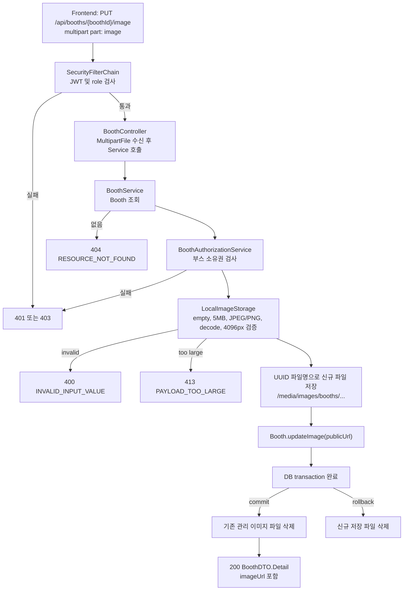

# Festi-Backend Implementation Plan

## Summary

Festi-Backend는 대학교 축제 통합 플랫폼의 API 서버다. Spring Boot + Java 기반으로 구현하며, PostgreSQL ERD와 `docs/PATCH.md`의 변경사항을 기준으로 도메인 모델, JWT 인증, 역할 기반 인가, 사용자 조회 API를 구성한다.

현재 체크아웃 기준으로 공통 인프라, UTC `OffsetDateTime` 기반 JPA auditing, PATCH 기반 도메인 재정렬, 축제별 로그인 ID 기반 인증/JWT, 기본 권한 체계, 모든 인증 사용자용 조회 API, 일반 사용자 즐겨찾기 API, 일반 사용자 웨이팅 등록/조회/취소 API, 부스 관리자 웨이팅 운영 API, Web Push 구독/표시 템플릿/호출 알림 발송 및 delivery 추적, 부스 신청/승인/삭제 워크플로우, 축제 관리자 변경 API, 부스 관리자 변경 API, Swagger/OpenAPI 문서화까지 구현되어 있다.

남은 핵심 작업은 `FOOD_TRUCK` 관리자 배정 정책 보정과 현재 구현된 일반 사용자/부스 관리자 API의 validation/test 보강이다.

이 문서는 현재 체크아웃 기준 구현 범위와 우선순위를 설명하며, 시점 의존적인 검증 이력과 세부 실행 로그는 별도 변경 이력 문서에서 관리한다.

| Priority | Scope | Status |
| --- | --- | --- |
| 1 | Spring Boot/Gradle 프로젝트 생성, Java 25 설정, 테스트 워크플로우 수정 | Done |
| 2 | 공통 설정: PostgreSQL, Flyway, JPA auditing, 공통 예외 응답, validation | Done |
| 3 | 초기 ERD 기반 Entity, enum, Repository, migration 작성 | Done |
| 4 | PATCH 반영 User/Auth/JWT 구현 | Done |
| 5 | SecurityConfig와 권한 체계 적용 | Done |
| 6 | 모든 인증 사용자용 조회 API 구현 | Done |
| 7 | PATCH 기반 도메인/migration 재정렬 | Done |
| 8 | 일반 사용자 API 구현 | Done |
| 9 | 부스 신청/승인/삭제 워크플로우 구현 | Done |
| 10 | 축제 관리자 API 구현 | Done |
| 11 | 부스 관리자 API 구현 | Done |
| 12 | 부스 관리자 웨이팅 운영 + 알림 API 구현 | Done |
| 13 | controller/service/repository 테스트 보강 | In Progress |
| 14 | Swagger/OpenAPI 문서화 | Done |

## Tech Stack

- Java 25
- Spring Boot 4.0.x
- Gradle 9.x
- Spring Web
- Spring Validation
- Spring Security
- Spring OAuth2 Resource Server
- Spring Data JPA
- PostgreSQL
- Flyway
- springdoc-openapi
- JUnit 5 / Spring Boot Test / Spring Security Test

## Current Implementation Baseline

### Implemented Entities

- `User`
  - `UserPK(festivalId, id)` composite primary key
  - `festival`, `passwordHash`, `name`, `phone`, `role`, `createdAt`, `updatedAt`
  - email 기반 로그인 정책은 제거됨
- `Booth`
  - `id`, `manager`, `name`, `category`, `type`, `description`, `operatingHours`, `imageUrl`, `isWaitingOpen`, `createdAt`, `updatedAt`
  - `isActive`와 `createdBy`는 제거됨
- `MenuItem`
  - `id`, `booth`, `name`, `price`, `description`, `imageUrl`, `isSoldOut`, `sortOrder`, `createdAt`, `updatedAt`
- `BoothLocation`
  - `id`, `festival`, nullable `booth`, `type`, nullable `index`, `day(FestivalDay)`, `zoneLabel`, `createdAt`, `updatedAt`
  - unique 기준은 `festival_id + zone_label + index + festival_day_id`
- `Waiting`
  - `id`, `booth`, composite-key `user`, `partySize`, `status`, `callCount`, `registeredAt`, `updatedAt`
- `PushSubscription`
  - `id`, composite-key `user`, `endpoint`, `p256dhKey`, `authKey`, `createdAt`, `updatedAt`
  - `endpoint`는 전역 unique이며 재등록 시 현재 사용자에게 재바인딩한다.
- `WaitingNotificationEvent`
  - `id`, `waiting`, `eventType`, payload snapshot(`title`, `body`, `icon`, `url`), `createdAt`
- `PushNotificationDelivery`
  - `id`, `event`, nullable `subscription`, endpoint snapshot, `status`, `responseStatus`, `failureReason`, `attemptedAt`, `createdAt`
- `Favorite`
  - `id`, `festival`, `userId`, `booth`, `createdAt`
  - unique 기준은 `festival_id + user_id + booth_id`
- `BoothApplication`
  - `id`, `festival`, `applicantId`, nullable `booth`, `boothName`, `boothType`, `boothCategory`, `description`, `status`, `reviewMemo`, `createdAt`, `updatedAt`
- `Festival`
  - `id`, `name`, `startDate`, `endDate`, `description`, `createdAt`, `updatedAt`
- `FestivalDay`
  - `id`, `festival`, `day`, `dayStart`, `dayEnd`, `nightStart`, `nightEnd`, `createdAt`, `updatedAt`
- `Notice`
  - `id`, `festival`, `title`, `content`, `pinned`, `createdAt`, `updatedAt`
  - `createdBy`와 notice type은 없음
- `Timeline`
  - `id`, `festival`, `day`, `title`, `artist`, `startTime`, `endTime`, `createdAt`, `updatedAt`

### Implemented Enums

- `UserRole`
  - `USER`
  - `BOOTH_MANAGER`
  - `FESTIVAL_ADMIN`
- `BoothCategory`
  - `ACTIVITY`
  - `INFO`
  - `MARKET`
  - `EXPERIENCE`
  - `PROMOTION`
  - `ALCOHOL`
- `BoothType`
  - `DAY`
  - `NIGHT`
  - `FOOD_TRUCK`
- `WaitingStatus`
  - `WAITING`
  - `CALLED`
  - `SEATED`
  - `CANCELLED`
- `BoothApplicationStatus`
  - `PENDING`
  - `APPROVED`
  - `REJECTED`
- `PushNotificationDeliveryStatus`
  - `PENDING`
  - `SENT`
  - `FAILED`

### Implemented Repositories

- `UserRepository`
  - `findByIdAndFestivalId`
  - `existsByIdAndFestivalId`
- `BoothRepository`
  - `findByTypeAndCategory`
  - `findByType`
  - `findByCategory`
- `MenuItemRepository`
  - `findByBoothIdOrderBySortOrder`
  - `findByIdAndBoothId`
- `BoothLocationRepository`
  - `findByDayAndTypeOrderByIndex`
  - `findByDayOrderByIndex`
  - `existsByFestivalIdAndDayAndZoneLabelAndIndex`
- `WaitingRepository`
  - `findByUserIdAndFestivalId`
  - `findByUserIdAndFestivalIdOrderByRegisteredAtDesc`
  - `findByBoothIdAndStatusOrderByRegisteredAt`
  - `findByBoothIdAndStatusInOrderByRegisteredAtAsc`
  - `countByUserIdAndFestivalIdAndStatusIn`
  - `existsByBoothIdAndUserIdAndFestivalIdAndStatusIn`
- `FavoriteRepository`
  - `findByFestivalIdAndUserIdOrderByCreatedAtDesc`
  - `existsByFestivalIdAndUserIdAndBoothId`
  - `countByFestivalIdAndUserIdAndBoothType`
- `BoothApplicationRepository`
  - `findByFestivalId`
  - `findByFestivalIdAndApplicantId`
  - `findByFestivalIdOrderByCreatedAtDesc`
  - `findByIdAndFestivalId`
  - `findFirstByFestivalIdAndApplicantIdOrderByCreatedAtDesc`
- `FestivalRepository`
- `FestivalDayRepository`
  - `findByFestivalIdOrderByDay`
  - `findByFestivalIdAndDay`
  - `findByIdAndFestivalId`
  - `existsByFestivalIdAndDay`
  - `existsByFestivalIdAndDayAndIdNot`
- `NoticeRepository`
  - `findByFestivalIdOrderByPinnedDescCreatedAtDesc`
  - `findByIdAndFestivalId`
- `TimelineRepository`
  - `findByFestivalIdOrderByDayAscStartTimeAsc`
  - `findByIdAndFestivalId`
- `PushSubscriptionRepository`
  - `findByEndpoint`
  - `findByIdAndUserIdAndFestivalId`
  - `findByUserIdAndFestivalId`
- `WaitingNotificationEventRepository`
- `PushNotificationDeliveryRepository`

`BoothAdminAssignmentRepository`와 `booth_admin_assignments` table은 PATCH 재정렬 후 제거되었다. v1 부스 관리자 소유권은 `booths.manager_id`를 기준으로 판단한다.

### Implemented API Documentation

- `springdoc-openapi-starter-webmvc-ui:3.0.3`
- `OpenApiConfig`
  - API title/version/description
  - JWT bearer security scheme
- Swagger/OpenAPI route allowlist
  - `/swagger-ui.html`
  - `/swagger-ui/**`
  - `/v3/api-docs`
  - `/v3/api-docs/**`
- 현재 controller에는 `@Tag`, `@Operation`, `@ApiResponses`, `@SecurityRequirement` 기반 문서화가 적용되어 있다.

### Implemented Migrations

- `V1__baseline.sql`
- `V2__init_schema.sql`
- `V3__users_phone_not_null.sql`
- `V4__domain_realignment.sql`
  - `booth_type`에 `FOOD_TRUCK` 추가
  - `users`를 `festival_id + id` composite PK로 재구성
  - `users.email`, `booths.is_active`, `booths.created_by`, `notices.created_by` 제거
  - `booths.manager`와 `waitings.user`를 composite user FK로 재구성
  - `booth_admin_assignments` table 제거
  - `notices.pinned` 추가
  - `festival_days`, `timelines`, `booth_applications`, `favorites` table 추가
  - `booth_locations`를 `festival_day_id` 기반 슬롯 모델로 재구성
- `V5__waiting_push_notification_persistence.sql`
  - `push_subscriptions`, `waiting_notification_events`, `push_notification_deliveries` table 추가
  - `push_notification_delivery_status` enum 추가
- `V6__waiting_notification_outbox_processing.sql`
  - 웨이팅 알림 outbox 처리 상태와 retry metadata 추가
- `V7__booth_application_created_booth_reference.sql`
  - `booth_applications.booth_id` nullable FK 및 unique 제약 추가
  - 승인된 신청에서 생성 부스를 재조회할 수 있도록 연결 저장

### Implemented Auditing and Temporal Policy

- `@CreatedDate` 또는 `@LastModifiedDate`가 붙은 persisted audit timestamp는 `OffsetDateTime`을 사용한다.
- `JpaAuditingConfig`는 `auditingDateTimeProvider`를 등록하고 JPA auditing에 UTC `OffsetDateTime` 값을 공급한다.
- `Festival`, `FestivalDay`, `Timeline`의 일정 필드는 audit instant가 아니라 축제 날짜/운영 시간을 표현하므로 `LocalDate` / `LocalTime`을 유지한다.
- `JpaAuditingConfigTest`와 `EntityTimeTypePolicyTest`가 auditing 타입 계약을 검증한다.

## Priority 1: Project Initialization

Spring Boot 프로젝트의 실행 가능한 최소 구조를 만들었다.

### Completed Deliverables

- `com.festi.backend` 루트 패키지 생성
- Gradle Wrapper 추가
- Java toolchain을 Java 25로 설정
- Spring Boot 4.0.x 의존성 구성
- 기본 `FestiBackendApplication` 추가
- `application.yml` 기본 설정 추가
- GitHub Actions 테스트 워크플로우를 JDK 25 기준으로 수정
- 최소 smoke test 추가

## Priority 2: Common Infrastructure

도메인 Entity와 API 구현 전에 모든 기능이 공유할 공통 기반을 고정했다.

### Completed Deliverables

- PostgreSQL 연결 설정
  - `FESTI_DATABASE_URL`
  - `FESTI_DATABASE_USERNAME`
  - `FESTI_DATABASE_PASSWORD`
  - `ddl-auto: validate`
  - `open-in-view: false`
- 테스트 profile 설정
  - `application-test.yml`
  - H2 기반 context test
- Flyway migration 구조
- JPA auditing
  - `@EnableJpaAuditing(dateTimeProviderRef = "auditingDateTimeProvider")`
  - UTC `OffsetDateTime`을 공급하는 `DateTimeProvider`
  - `BaseTimeEntity`
- 공통 예외 처리
  - `ErrorCode`
  - `FestiException`
  - `BadRequestException`
  - `ConflictException`
  - `NotFoundException`
  - `GlobalExceptionHandler`
- 공통 에러 응답
  - `ErrorResponse`
  - validation details는 민감 입력값 노출을 피하기 위해 rejected value를 포함하지 않음

## Priority 3: Initial Entity, Enum, Repository, Migration

초기 ERD 기준 Entity, enum, repository, PostgreSQL migration을 구현했다. 이후 `V4__domain_realignment.sql`에서 PATCH 기반 모델로 재정렬했다.

### Completed Deliverables

- 초기 Entity와 enum 구현
- 초기 JPA Repository 구현
- PostgreSQL schema migration `V2__init_schema.sql`
- 사용자 스키마 보강 migration `V3__users_phone_not_null.sql`
- Lombok 기반 Entity/Common 클래스 보일러플레이트 정리
- 테스트를 H2 fast test(`./gradlew test`)와 PostgreSQL migration test(`./gradlew postgresTest`)로 분리

## Priority 4: PATCH-Aligned User/Auth/JWT

축제별 로그인 ID 기반 회원가입, 로그인, 본인 정보 API가 구현되어 있다.

### Current Behavior

- `POST /api/auth/signup`
  - request: `id`, `password`, `name`, `phone`
  - 기본 role은 `USER`
  - 비밀번호는 BCrypt hash로 저장
  - 같은 축제 안에서 `id` 중복 시 `409`
- `POST /api/auth/login`
  - request: `id`, `password`
  - 로그인 성공 시 JWT access token 발급
- `GET /api/users/me`
- `PATCH /api/users/me`
  - 현재 수정 가능 필드는 `name`, `phone`
- JWT claim
  - `sub`: 사용자 로그인 ID
  - `festivalId`: 축제 ID
  - `role`: `UserRole`
- malformed `role`, malformed `festivalId`, missing subject/required claim은 `401 AUTHENTICATION_REQUIRED`로 처리한다.

### Current Limitation

- 회원가입/로그인은 현재 단일 축제 운영을 전제로 첫 번째 `Festival` row를 사용한다. 다중 축제 선택 또는 축제별 로그인 context 전달은 아직 구현되지 않았다.
- 총 관리자 계정 `admin / pw` 사전 생성은 아직 구현되지 않았다.
- refresh token은 v1 범위에서 제외한다.

### Completed Deliverables

- `AuthDTO`, `UserDTO` 구현
- `AuthController`, `UserController` 구현
- `AuthService`, `UserService` 구현
- `UserPK` composite primary key 적용
- JWT 발급/변환 계층 구현
- DTO / service / JWT converter / JWT issuance / security exception handler 테스트 추가

## Priority 5: Security and Authorization

Spring Security 기반 인증/인가 구조를 적용했다.

### Current Behavior

- 회원가입/로그인은 `permitAll`
- `POST /api/booth-applications`는 `permitAll`이며 신청 생성 controller/service가 구현되어 있다.
- `GET /media/images/**`는 업로드된 축제 콘텐츠 조회를 위해 `permitAll`이다.
- 모든 인증 사용자 조회 API와 본인 정보 API는 `authenticated`
- 일반 사용자 전용 API는 `ROLE_USER`
- 축제 관리자 API는 `ROLE_FESTIVAL_ADMIN`
- 부스 관리자 API는 `ROLE_BOOTH_MANAGER` 또는 `ROLE_FESTIVAL_ADMIN` coarse gate
- 부스 관리자 권한은 role만 보지 않고 `booths.manager_id`와 현재 사용자 ID 일치를 검증한다.
- `FESTIVAL_ADMIN`은 부스 관리자 권한도 통과한다.
- 문서에 정의되지 않은 라우트는 기본 `denyAll`

### Completed Deliverables

- `SecurityConfig`에 API Access Policy 반영
- `AuthenticatedUser`
  - `id`
  - `festivalId`
  - `role`
- `BoothAuthorizationService`
  - `AuthenticatedUser`와 `Booth` 엔티티를 기준으로 부스 소유권 검증
  - `FESTIVAL_ADMIN` 우회 허용
  - `BOOTH_MANAGER`는 `booths.manager_id`와 현재 사용자 id가 일치할 때만 허용
- `SecurityRoutePolicyIntegrationTest`
- `BoothAuthorizationServiceTest`

## Priority 6: All Authenticated Read APIs

모든 인증 사용자가 조회할 수 있는 API를 구현했다.

### Implemented APIs

- `GET /api/booths`
  - 선택 필터: `day`, `type`, `category`
  - `day`가 있으면 `FestivalDay`와 `BoothLocation` 기반으로 배치된 부스를 조회한다.
  - `day`가 없으면 `type`, `category` 기반으로 부스를 조회한다.
- `GET /api/booths/{boothId}`
- `GET /api/booths/{boothId}/menus`
- `GET /api/locations`
  - 필수 필터: `day`, `type`
  - 배정되지 않은 slot도 응답에 포함할 수 있다.
- `GET /api/festival`
- `GET /api/festival/days`
  - 축제 운영 일자 ID와 날짜 목록을 조회한다.
- `GET /api/festival/notices`
  - `pinned` 우선, 같은 그룹 안에서는 최신순
- `GET /api/festival/timelines`
  - 축제 일자, 시작 시간 순
- `GET /api/users/me`
- `PATCH /api/users/me`

### Completed Deliverables

- 조회 전용 DTO / Service / Controller 구현
  - `BoothDTO`, `MenuDTO`, `LocationDTO`, `FestivalDTO`, `FestivalDayDTO`, `NoticeDTO`, `TimelineDTO`, `WaitingDTO`
- 조회 API 구현
  - 부스 목록 / 상세 / 메뉴
  - 배치도
  - 축제 정보 / 축제 운영 일자 / 공지사항 / 공연 타임라인
  - 본인 정보 조회/수정
- 조회 정책 반영
  - 부스 목록은 `day`, `type`, `category` 조합 필터 지원
  - 배치도는 `day`, `type` 필수
  - 목록은 빈 배열, 단건은 미존재 시 `404`

## Priority 7: PATCH-Based Domain Realignment

`docs/PATCH.md`의 변경사항을 반영해 도메인과 migration을 재정렬했다.

### Completed Deliverables

- User/Auth
  - UUID 기반 `User.id`와 email 로그인 정책 제거
  - 사용자 로그인 ID 문자열을 사용자 식별자로 사용
  - `festival_id + id` composite primary key 적용
  - 사용자 FK를 가진 테이블은 축제별 사용자 식별자를 참조하도록 재설계
- Booth / BoothApplication
  - `Booth.active` / `is_active` 제거
  - `BoothRepository`의 active 기반 조회 제거
  - `BoothApplication` entity, enum, repository, table 추가
  - `BoothApplicationStatus`는 `PENDING`, `APPROVED`, `REJECTED`
  - 승인된 `BoothApplication`은 생성된 `Booth`를 nullable one-to-one 참조하고 응답에 `boothId`를 포함
- Booth / Food Truck / Location
  - `BoothType.FOOD_TRUCK` 추가
  - 푸드트럭은 내부적으로 `Booth`로 표현
  - `BoothLocation`을 축제별 `FestivalDay` slot 모델로 재구성
  - 여러 `BoothLocation` row가 같은 `booth_id`를 가질 수 있는 구조 반영
- Favorite
  - `Favorite` entity, repository, table 추가
  - 사용자당 부스 중복 즐겨찾기 방지 unique 제약 추가
  - 생성 시각 기록
- Festival / Notice / Timeline
  - `FestivalDay` entity, repository, table 추가
  - `Notice.pinned` 추가
  - `Timeline` entity, repository, table 추가
- Waiting
  - `Waiting.user`를 축제별 composite user FK로 재구성
  - 사용자별 웨이팅 조회 repository 추가

### Remaining Domain Gaps

- `FOOD_TRUCK`의 manager를 축제 관리자 계정으로 제한하는 정책은 아직 적용되지 않았다. 현재 신청 승인 경로는 `boothType`과 무관하게 신청자의 `BOOTH_MANAGER` 계정을 생성 부스에 배정한다.
- 부스 관리자용 웨이팅 목록/호출/상태 변경/오픈·마감과 Web Push 구독/event/delivery 저장, VAPID 기반 호출 Push 발송 연결은 구현되어 있다.

## Priority 8: General User APIs

일반 사용자 전용 API 중 즐겨찾기와 웨이팅 등록/조회/취소가 구현되어 있다.

### Implemented APIs

- `POST /api/favorites`
  - `USER`만 접근 가능
  - 같은 부스 중복 등록 시 `409`
  - 부스 타입별 최대 5개 제한
- `GET /api/favorites`
  - `USER`만 접근 가능
  - 생성 시각 역순 조회
- `DELETE /api/favorites/{favoriteId}`
  - `USER`만 접근 가능
  - 본인 즐겨찾기만 hard delete
- `GET /api/waitings`
  - `USER`만 접근 가능
  - 현재 사용자와 축제 ID 기준 조회
  - `booth` fetch plan 적용
- `POST /api/booths/{boothId}/waitings`
  - `USER`만 접근 가능
  - `NIGHT` 부스만 등록 가능
  - 부스의 `isWaitingOpen`이 true일 때만 등록 가능
  - `partySize`는 1 이상이어야 함
  - 현재 사용자 기준 active waiting(`WAITING`, `CALLED`) 최대 3개 제한
  - 같은 부스에는 active waiting을 중복 등록할 수 없음
- `DELETE /api/waitings/{waitingId}`
  - `USER`만 접근 가능
  - 본인 웨이팅만 취소 가능
  - `WAITING`, `CALLED` 상태만 취소 가능

### Follow-Up Hardening

- 즐겨찾기 request validation 보강
- `FavoriteServiceTest` / favorite controller integration test 추가
- `WaitingServiceTest`의 등록 성공/취소 정책 테스트 추가
- 일반 사용자 웨이팅 취소 controller integration test 추가

## Priority 9: Booth Application Workflow

부스 신청과 승인 워크플로우가 구현되어 있다. 공개 신청 생성은 JWT 없이 가능하고, 생성된 `BOOTH_MANAGER` 계정은 기존 로그인 API로 JWT를 발급받는다.

### Implemented APIs

#### Permit All

- `POST /api/booth-applications`
  - 부스 관리자 회원가입과 부스 신청을 동시에 처리한다.
  - 성공 시 `BOOTH_MANAGER` 계정과 `BoothApplication`을 함께 생성한다.
  - 신청 상태는 `PENDING`으로 시작한다.

#### Booth Manager

- `GET /api/booth-applications/me`
  - 현재 부스 관리자 계정의 신청 상태를 조회한다.
  - 승인 완료 시 응답의 `boothId`로 담당 부스 관리 API를 호출할 수 있다.

#### Festival Admin

- `GET /api/admin/booth-applications`
- `GET /api/admin/booth-applications/{applicationId}`
- `POST /api/admin/booth-applications/{applicationId}/approve`
  - `PENDING` 신청을 승인하고 생성된 `Booth`를 신청에 연결한다.
  - 응답 `boothId`는 생성된 부스 UUID이며, 승인 전 또는 거절 응답에서는 `null`이다.
- `POST /api/admin/booth-applications/{applicationId}/reject`
- `DELETE /api/admin/booth-applications/{applicationId}`

### Validation Rules

- 승인 전 신청만 삭제할 수 있다.
- 신청 삭제 시 신청과 함께 생성된 `BOOTH_MANAGER` 계정도 hard delete한다.
- 승인된 신청은 삭제할 수 없고 `409 Conflict`를 반환한다.
- 승인 시 실제 `Booth`를 생성한다.
- 승인된 신청의 manager 계정은 생성된 `Booth.manager`가 된다.
- 신청 DTO와 엔티티는 이미지를 보관하지 않으며, 승인된 부스 이미지는 별도 업로드 API에서만 생성한다.
- 승인/거절은 `PENDING` 상태에서만 가능하며, 이미 심사된 신청은 `409 Conflict`를 반환한다.
- 거절 메모는 선택 입력이고 blank 값은 `null`로 정규화한다.
- 거절된 신청은 승인 전 신청과 동일하게 삭제 가능 대상으로 본다.
- 운영 중/운영 후 부스 삭제는 지원하지 않는다.

## Priority 10: Festival Admin APIs

축제 관리자 권한이 필요한 변경 API가 구현되어 있다.

### Implemented APIs

- `PATCH /api/festival`
- `POST /api/festival/days`
- `PATCH /api/festival/days/{festivalDayId}`
- `DELETE /api/festival/days/{festivalDayId}`
- `POST /api/festival/notices`
- `PATCH /api/festival/notices/{noticeId}`
- `DELETE /api/festival/notices/{noticeId}`
- `POST /api/festival/timelines`
- `PATCH /api/festival/timelines/{timelineId}`
- `DELETE /api/festival/timelines/{timelineId}`
- `POST /api/locations/slots`
- `POST /api/locations/{locationId}/assignment`
- `DELETE /api/locations/{locationId}/assignment`

### Validation Rules

- 공지는 pinned 여러 개를 허용한다.
- 공지 목록은 pinned 우선, 같은 그룹 안에서는 작성일 순으로 정렬한다.
- 배치도 슬롯 생성은 프론트가 전달한 구역별 칸 수 정보를 기준으로 한다.
- 이미 부스가 배정된 슬롯에는 다른 부스를 바로 배정할 수 없다.
- 슬롯 배정을 바꾸려면 기존 배정을 먼저 취소한다.
- 슬롯 배정 취소는 슬롯 번호를 보존하고 부스 연결만 제거한다.
- 승인된 부스 자체를 삭제하는 API는 제공하지 않는다.

## Priority 11: Booth Manager APIs

부스 관리자 권한이 필요한 부스/메뉴 변경 API가 구현되어 있다. `SecurityConfig`의 coarse role gate 이후 service 계층에서 담당 부스 소유권을 검증한다.

### Implemented APIs

- `PATCH /api/booths/{boothId}`
- `PUT /api/booths/{boothId}/image`
- `DELETE /api/booths/{boothId}/image`
- `POST /api/booths/{boothId}/menus`
- `PATCH /api/booths/{boothId}/menus/{menuId}`
- `DELETE /api/booths/{boothId}/menus/{menuId}`
- `PUT /api/booths/{boothId}/menus/{menuId}/image`
- `DELETE /api/booths/{boothId}/menus/{menuId}/image`
- `POST /api/booths/{boothId}/menus/{menuId}/sold-out`

### Implemented Validation Rules

- `BOOTH_MANAGER`는 본인 담당 부스만 수정할 수 있다.
- `FESTIVAL_ADMIN`은 부스 관리자 API를 우회 통과할 수 있다.
- 메뉴 생성/수정은 `NIGHT` 또는 `FOOD_TRUCK` 부스에서만 허용한다.
- 메뉴 삭제/품절 처리는 담당 부스 권한을 검증한 뒤 수행한다.
- 부스/푸드트럭/메뉴 일반 정보 요청은 `imageUrl`을 받지 않으며 이미지는 전용 multipart API로만 교체 또는 제거한다.
- 이미지 업로드는 JPEG/PNG, 최대 `5MB`, 최대 `4096x4096`만 허용한다.
- 로컬 이미지 URL은 `/media/images/**`로 공개하고, 교체/삭제 시 commit 이후 기존 관리 파일만 지운다. 신규 파일은 transaction rollback 시 정리한다.

### Image Upload And Removal

부스 신청 단계에는 이미지가 없으며, 신청 승인 후 생성된 `Booth`와 해당 부스의 `MenuItem`만 이미지 교체/제거 대상이다. 따라서 `BoothApplicationDTO.CreateRequest`, `BoothApplicationDTO.Response`, `BoothApplication`, `BoothDTO`의 생성/수정 request, `MenuDTO.Request`에서는 `imageUrl`을 사용하지 않는다. 조회 response의 `BoothDTO.Summary.imageUrl`, `BoothDTO.Detail.imageUrl`, `MenuDTO.Response.imageUrl`은 유지한다.

#### Endpoints

| Method | Endpoint | Request | Response | Access |
| --- | --- | --- | --- | --- |
| `PUT` | `/api/booths/{boothId}/image` | `multipart/form-data`, part `image` | `200 BoothDTO.Detail` | 소유 `BOOTH_MANAGER` 또는 `FESTIVAL_ADMIN` |
| `DELETE` | `/api/booths/{boothId}/image` | 없음 | `204` | 소유 `BOOTH_MANAGER` 또는 `FESTIVAL_ADMIN` |
| `PUT` | `/api/booths/{boothId}/menus/{menuId}/image` | `multipart/form-data`, part `image` | `200 MenuDTO.Response` | 소유 `BOOTH_MANAGER` 또는 `FESTIVAL_ADMIN` |
| `DELETE` | `/api/booths/{boothId}/menus/{menuId}/image` | 없음 | `204` | 소유 `BOOTH_MANAGER` 또는 `FESTIVAL_ADMIN` |
| `GET` | `/media/images/**` | 없음 | 이미지 binary | 모두 |

#### Storage And Error Contract

- `ImageStorageProperties`는 기본 저장 root `./uploads/images`와 공개 prefix `/media/images`를 바인딩한다. 운영 저장 root는 `FESTI_IMAGE_STORAGE_ROOT`, 예를 들어 `/srv/festi/uploads/images`로 주입한다.
- `LocalImageStorage`는 원본 파일명을 저장 경로에 사용하지 않고 UUID를 사용한다. 부스 파일은 `/media/images/booths/{uuid}.jpg|png`, 메뉴 파일은 `/media/images/menus/{uuid}.jpg|png` URL로 반환한다.
- 빈 파일, 누락된 `image` part, JPEG/PNG가 아닌 파일, 실제 디코딩할 수 없는 파일, 폭 또는 높이가 `4096`을 초과한 파일은 `400 INVALID_INPUT_VALUE`로 거부한다.
- `5MB`를 초과한 파일 또는 multipart parser에서 제한을 초과한 요청은 `413 PAYLOAD_TOO_LARGE`로 반환한다.
- Spring MVC resource handler가 storage root를 `/media/images/**`에 매핑하고, `SecurityConfig`는 이 공개 이미지 조회를 인증 없이 허용한다.

#### Transaction And Deletion Rules

- `BoothService`와 `MenuService`는 리소스 조회, 권한 확인, 새 이미지 저장, 엔티티 URL 변경, 응답 DTO 생성을 담당한다.
- 이미지 교체 중 DB transaction이 rollback되면 새로 저장된 파일을 삭제한다. commit되면 이전 이미지 중 `/media/images/` prefix로 관리되는 로컬 파일만 삭제한다.
- 이미지 제거는 `imageUrl = null` 변경을 먼저 commit한 뒤 이전 관리 파일을 삭제하며, 이미지가 이미 없는 경우에도 `204`를 반환한다.
- 기존 데이터에 남아 있는 외부 URL은 물리 파일 삭제 대상으로 보지 않는다.
- 기존 메뉴 삭제와 푸드트럭 삭제도 commit 이후 로컬 이미지 파일을 정리한다. 푸드트럭 삭제 시 연결된 메뉴의 관리 이미지도 함께 정리한다.

#### Controller Upload Flow

메뉴 이미지 업로드는 `MenuController -> MenuService -> MenuItem.updateImage(...)` 순서로 동일하게 처리한다. `DELETE` 제거 요청은 파일 검증과 신규 저장 단계를 생략하고, 엔티티의 `imageUrl`을 `null`로 commit한 뒤 이전 관리 파일을 삭제한다.

### Follow-Up Hardening

- `BoothServiceTest`에 부스 수정과 소유권 검증 연계 테스트를 추가한다.
- `MenuServiceTest`에 메뉴 생성/수정/삭제/품절 및 `NIGHT` 제약 테스트를 추가한다.
- 부스 관리자 변경 endpoint의 controller integration test를 추가한다.
- `FOOD_TRUCK` 생성/승인 시 manager 정책을 도메인 규칙과 일치시키고 테스트로 고정한다.

## Priority 12: Booth Manager Waiting Operations and Notifications

일반 사용자의 웨이팅 등록/조회/취소, 부스 관리자의 운영 목록/호출/착석/접수 상태 변경, 사용자의 Web Push 구독 관리, 호출 Push outbox 적재와 scheduler 기반 발송 및 결과 기록이 현재 코드에 구현되어 있다.

### Implemented Runtime Scope

- 웨이팅 대상은 `NIGHT` 부스뿐이며 해당 부스의 `isWaitingOpen`이 true인 경우에만 사용자가 등록할 수 있다.
- active waiting은 `WAITING`, `CALLED`이고, 한 사용자는 active waiting을 최대 3개 보유할 수 있으며 같은 부스에 active waiting을 중복 등록할 수 없다.
- 호출 흐름은 `WAITING -> CALLED -> SEATED`를 기본으로 한다. `CALLED` 상태의 재호출은 허용되며 상태를 유지한 채 `callCount`를 증가시키고 새 Push 알림을 생성한다.
- 사용자는 본인의 `WAITING` 또는 `CALLED` waiting만 `CANCELLED`로 취소할 수 있다.
- `BOOTH_MANAGER`는 담당 부스의 웨이팅만 운영할 수 있고, `FESTIVAL_ADMIN`은 관리 API를 통과할 수 있다. 담당 부스 확인은 `BoothAuthorizationService`에서 수행한다.

### Implemented Models

#### Entities

| Entity | Table | 현재 역할과 주요 필드 |
| --- | --- | --- |
| `Waiting` | `waitings` | 부스와 composite-key 사용자를 연결하는 웨이팅. `partySize`, `status`, `callCount`, `registeredAt`, `updatedAt`을 보유한다. |
| `PushSubscription` | `push_subscriptions` | 사용자 브라우저의 Web Push 구독. `endpoint`, `p256dhKey`, `authKey`와 사용자를 저장하며 `endpoint`는 전역 unique다. |
| `WaitingNotificationEvent` | `waiting_notification_events` | 한 번의 호출/재호출로 생성된 outbox event와 payload snapshot. `eventType`, `title`, `body`, `icon`, `url`, `status`, `attemptCount`, `availableAt`, `processingStartedAt`, `processedAt`, `failureReason`, `createdAt`을 저장한다. |
| `PushNotificationDelivery` | `push_notification_deliveries` | event를 한 subscription endpoint로 보낸 한 번의 시도. `status`, `responseStatus`, `failureReason`, `retryable`, `attemptedAt`, `createdAt`을 저장한다. |

#### DTOs And Payload Models

| Model | 필드 | 용도 |
| --- | --- | --- |
| `WaitingDTO.Request` | `partySize` | 사용자 웨이팅 등록 요청. `partySize >= 1` validation을 적용한다. |
| `WaitingDTO.Response` | `id`, `boothSummary`, `partySize`, `status`, `callCount`, `registeredAt` | 사용자/관리자 웨이팅 응답 모델이다. |
| `WaitingDTO.StatusRequest` | `status` | 관리자 착석 처리 요청. 서비스는 현재 `SEATED`만 허용한다. |
| `WaitingDTO.OpenStatusRequest` | `open` | 관리자가 야간 부스의 웨이팅 접수를 열거나 닫는 요청이다. |
| `PushSubscriptionDTO.Request` | `endpoint`, `keys` | 사용자 Push 구독 등록/갱신 요청이다. |
| `PushSubscriptionDTO.Keys` | `p256dh`, `auth` | 브라우저 Web Push 암호화 key pair다. |
| `PushSubscriptionDTO.Response` | `id`, `endpoint` | 등록 또는 갱신된 구독의 응답이다. |
| `PushNotificationPayload` | `title`, `body`, `icon`, `url` | service worker가 표시와 클릭 이동에 사용할 실제 Push payload다. |

#### Enums And Configuration Models

| Model | 값 또는 필드 | 용도 |
| --- | --- | --- |
| `WaitingStatus` | `WAITING`, `CALLED`, `SEATED`, `CANCELLED` | 웨이팅 생명주기 상태다. |
| `WaitingNotificationEventStatus` | `PENDING`, `PROCESSING`, `COMPLETED`, `RETRY_WAIT`, `FAILED` | outbox event의 처리/재처리 상태다. |
| `PushNotificationDeliveryStatus` | `PENDING`, `SENT`, `FAILED` | 구독별 전송 시도의 상태다. |
| `PushMessageProperties.PushMessageTemplate` | `title`, `body`, `icon` | `push-messages.yml`의 `festi.push.messages.called` 표시 템플릿을 바인딩한다. |
| `WebPushProperties` | `enabled`, `publicKey`, `privateKey`, `subject`, `ttlSeconds` | `festi.push.delivery` 설정을 바인딩하고 VAPID 발송 활성화 여부를 결정한다. |
| `PushDeliveryWorkerProperties` | `enabled`, `pollDelayMillis`, `batchSize`, `maxAttempts`, `retryDelaySeconds`, `processingTimeoutSeconds` | outbox scheduler의 실행, batch, 재시도, processing lease 만료 기준을 바인딩한다. |

### Implemented Endpoints

모든 아래 endpoint는 controller 구현과 `SecurityConfig`의 접근 정책이 모두 존재한다. `인증 필요`가 `예`인 경우 JWT bearer token이 필요하다.

| Method | Endpoint | 동작 | 인증 필요 | 허용 `UserRole` | 요청/응답 |
| --- | --- | --- | --- | --- | --- |
| `POST` | `/api/booths/{boothId}/waitings` | 본인 웨이팅 등록 | 예 | `USER` | `WaitingDTO.Request` -> `201 WaitingDTO.Response` |
| `GET` | `/api/waitings` | 본인 웨이팅 목록 조회 | 예 | `USER` | `200 List<WaitingDTO.Response>` |
| `DELETE` | `/api/waitings/{waitingId}` | 본인 active waiting 취소 | 예 | `USER` | `204` |
| `GET` | `/api/booths/{boothId}/waitings` | 담당 부스의 active waiting 목록 조회 | 예 | `BOOTH_MANAGER`, `FESTIVAL_ADMIN` | `200 List<WaitingDTO.Response>` |
| `POST` | `/api/waitings/{waitingId}/call` | active waiting 호출 또는 재호출 및 Push outbox event 생성 | 예 | `BOOTH_MANAGER`, `FESTIVAL_ADMIN` | `200 WaitingDTO.Response` |
| `PATCH` | `/api/waitings/{waitingId}/status` | `CALLED` waiting을 착석 처리 | 예 | `BOOTH_MANAGER`, `FESTIVAL_ADMIN` | `WaitingDTO.StatusRequest` -> `200 WaitingDTO.Response` |
| `PATCH` | `/api/booths/{boothId}/waitings/status` | `NIGHT` 부스 웨이팅 접수 오픈/마감 | 예 | `BOOTH_MANAGER`, `FESTIVAL_ADMIN` | `WaitingDTO.OpenStatusRequest` -> `200 BoothDTO.Detail` |
| `POST` | `/api/push-subscriptions` | 본인의 Web Push 구독 등록 또는 갱신 | 예 | `USER` | `PushSubscriptionDTO.Request` -> `201 PushSubscriptionDTO.Response` |
| `DELETE` | `/api/push-subscriptions/{subscriptionId}` | 본인 Web Push 구독 해제 | 예 | `USER` | `204` |

### Waiting Operations

1. 사용자가 `POST /api/booths/{boothId}/waitings`를 호출하면 서버는 `NIGHT` 부스 여부, 접수 오픈 여부, 사용자 active waiting 최대 3개 제한, 같은 부스 active 중복 여부를 검사하고 `WAITING` 상태의 `Waiting`을 생성한다.
2. 사용자는 `GET /api/waitings`로 자신의 전체 웨이팅을 조회하고, 아직 active인 waiting은 `DELETE /api/waitings/{waitingId}`로 취소할 수 있다.
3. 관리자는 `GET /api/booths/{boothId}/waitings`로 `WAITING`, `CALLED` 상태만 등록 시각 오름차순으로 확인한다.
4. 관리자가 `POST /api/waitings/{waitingId}/call`을 호출하면 `WAITING`은 `CALLED`로 전이하고 `callCount`가 증가한다. 이미 호출된 `CALLED`도 재호출할 수 있으며 `callCount`와 알림 횟수가 추가된다.
5. 관리자는 사용자가 입장하면 `PATCH /api/waitings/{waitingId}/status`에 `{ "status": "SEATED" }`를 보내 `CALLED -> SEATED` 전이를 수행한다.
6. 관리자는 `PATCH /api/booths/{boothId}/waitings/status`로 `NIGHT` 부스의 신규 접수를 열거나 닫는다.

### Push Notification Operation

1. 사용자의 브라우저는 서버가 발송에 사용하는 VAPID 공개키와 동일한 공개키로 Web Push subscription을 생성하고 `POST /api/push-subscriptions`로 endpoint와 암호화 key를 등록한다. 현재 백엔드에는 VAPID 공개키를 조회하는 endpoint가 없다.
2. `PushSubscriptionService`는 `endpoint`를 전역 unique로 취급한다. 같은 브라우저 endpoint가 다시 등록되면 최신 로그인 사용자와 key로 재바인딩하여 공유 기기에서 이전 계정으로 알림이 계속 가는 상황을 피한다.
3. `POST /api/waitings/{waitingId}/call` 처리에서 `WaitingService`는 waiting을 호출 상태로 변경한 뒤 `WaitingNotificationService.enqueueCalled(...)`로 `PENDING` 상태의 `CALLED` outbox event를 같은 트랜잭션에 저장한다. 호출과 재호출은 각각 별도의 event를 만든다.
4. event에는 `push-messages.yml`의 `called.title`, `called.body`, `called.icon`과 코드에 정의된 클릭 경로 `/waitings`가 payload snapshot으로 저장된다. 호출 API는 외부 Push 요청을 수행하지 않고 waiting 변경과 event 저장이 커밋되면 응답한다.
5. `WaitingNotificationDeliveryScheduler`는 설정된 polling 주기마다 처리 가능한 event를 조회한다. `WaitingNotificationOutboxCoordinator`는 PostgreSQL `FOR UPDATE SKIP LOCKED`로 event를 claim하고 `PROCESSING`으로 전환하여 여러 worker가 같은 event를 동시에 가져가지 않게 한다.
6. worker는 claim 트랜잭션이 종료된 뒤 해당 사용자의 현재 `PushSubscription`을 대상으로 `WebPushSender`를 호출한다. 따라서 VAPID HTTP 요청을 기다리는 동안 호출 API 트랜잭션이나 claim 트랜잭션을 열어 두지 않는다.
7. 각 endpoint별 시도는 먼저 `PENDING` `PushNotificationDelivery`로 저장되고, 전송 후 `SENT` 또는 `FAILED` 및 `retryable` 여부가 기록된다. 이미 terminal 결과가 있는 endpoint는 event 재처리에서 다시 발송하지 않는다.
8. `429`, `5xx`, interruption 이외의 transport exception은 event를 `RETRY_WAIT`로 두고 지연 후 다시 처리한다. 최대 처리 횟수를 넘긴 일시 실패 또는 interruption은 event를 `FAILED`로 종료한다. 비재시도 delivery만 존재하거나 모든 대상 전송이 완료되면 event는 `COMPLETED`가 된다.
9. worker가 `PROCESSING` 중 종료되면 processing lease 만료 후 event를 다시 `RETRY_WAIT`로 회수한다. 이미 외부 전송이 성공했지만 결과 저장 전에 프로세스가 종료된 극단적 경우에는 Web Push 특성상 재처리로 중복 알림 가능성이 남는다.
10. Push payload는 상태 전체를 동기화하는 응답이 아니다. 백엔드가 제공하는 계약은 프론트엔드 service worker가 `title`, `body`, `icon`으로 알림을 표시하고 클릭 시 `url`인 `/waitings`로 이동시키는 데 사용할 값이며, 최신 waiting 상태는 클라이언트가 `GET /api/waitings`로 다시 조회한다.

### Persistence And Configuration Notes

- `waiting_notification_events`는 사용자에게 전달하려던 메시지 snapshot과 outbox 처리 상태를 보존하고, `push_notification_deliveries`는 구독 endpoint별 실제 시도와 결과를 보존한다. 하나의 event에는 다수 기기 또는 지연 재시도로 여러 delivery가 연결될 수 있다.
- 표시 문자열과 아이콘 경로는 `src/main/resources/push-messages.yml`의 `title`, `body`, `icon`만 변경해 수정할 수 있다. 클릭 경로 `url`은 설정 필드가 아니라 코드 계약이다.
- 실제 Web Push 전송을 활성화하려면 `FESTI_WEB_PUSH_ENABLED=true`와 `FESTI_VAPID_PUBLIC_KEY`, `FESTI_VAPID_PRIVATE_KEY`, `FESTI_VAPID_SUBJECT`가 필요하다. TTL은 `FESTI_WEB_PUSH_TTL_SECONDS`로 설정한다.
- outbox worker는 기본 활성화되며 `FESTI_WEB_PUSH_WORKER_ENABLED`, `FESTI_WEB_PUSH_POLL_DELAY_MILLIS`, `FESTI_WEB_PUSH_BATCH_SIZE`, `FESTI_WEB_PUSH_MAX_ATTEMPTS`, `FESTI_WEB_PUSH_RETRY_DELAY_SECONDS`, `FESTI_WEB_PUSH_PROCESSING_TIMEOUT_SECONDS`로 실행과 재처리 정책을 조정한다.
- 업로드 이미지는 기본 `./uploads/images`, 운영에서는 `FESTI_IMAGE_STORAGE_ROOT`로 지정한 영구 디렉터리에 저장한다. 기존 외부 URL은 읽기 값으로 유지되며 `/media/images/` URL만 물리 삭제한다.

## Priority 13: Test Coverage

현재 구현된 slice에 대한 단위/통합 테스트가 추가되어 있다. 남은 API 구현 시 각 service/controller/security 경계를 함께 보강한다.

### Current Tests

- `FestiBackendApplicationTests`
- `PostgresMigrationApplicationTests`
- `AuthDTOTest`
- `AuthServiceTest`
- `AuthUserControllerIntegrationTest`
- `UserDTOTest`
- `UserServiceTest`
- `BoothApplicationDTOTest`
- `BoothApplicationServiceTest`
- `BoothApplicationControllerIntegrationTest`
- `FestivalAdminDTOTest`
- `FestivalAdminControllerIntegrationTest`
- `UserLevelReadControllerIntegrationTest`
- `BoothManagerWaitingControllerIntegrationTest`
- `PushSubscriptionControllerIntegrationTest`
- `HmacJwtTokenServiceTest`
- `JwtAuthenticationConverterTest`
- `SecurityExceptionHandlersTest`
- `SecurityRoutePolicyIntegrationTest`
- `BoothAuthorizationServiceTest`
- `BoothServiceTest`
- `MenuServiceTest`
- `LocalImageStorageTest`
- `ImageFileTransactionManagerTest`
- `LocationServiceTest`
- `FestivalServiceTest`
- `WaitingServiceTest`
- `WaitingDTOTest`
- `PushSubscriptionDTOTest`
- `PushSubscriptionServiceTest`
- `NotificationPersistenceModelTest`
- `PushMessagePropertiesTest`
- `WaitingNotificationServiceTest`
- `WaitingNotificationOutboxCoordinatorTest`
- `WaitingNotificationDeliveryWorkerTest`
- `VapidWebPushSenderTest`
- `RepositoryFetchPlanTest`
- `GlobalExceptionHandlerTest`
- `ErrorResponseTest`
- `JpaAuditingConfigTest`
- `EntityTimeTypePolicyTest`

### Tests To Add Or Expand

- `FavoriteServiceTest`
  - 타입별 5개 제한
  - 생성 시각 정렬
  - hard delete
  - 중복 등록 차단
- `FavoriteControllerIntegrationTest`
  - `USER` 접근 허용
  - `BOOTH_MANAGER` / `FESTIVAL_ADMIN` 접근 시 `403`
- `BoothServiceTest` 확장
  - 담당 부스 수정 권한
  - 부스 정보 변경 결과
- `BoothApplicationServiceTest` 확장
  - `FOOD_TRUCK` 승인 시 manager 배정 정책
- `MenuServiceTest` 확장
  - 야간 부스 메뉴 생성 성공
  - 주간 부스 메뉴 생성 실패
  - 수정/삭제 권한 검증
  - 품절 처리
- 부스 관리자 변경 controller integration test
  - `BOOTH_MANAGER` 담당 부스 변경 허용
  - 다른 부스 변경 거절
  - `FESTIVAL_ADMIN` 우회 허용
- `WaitingServiceTest` 확장
  - 웨이팅 등록 성공
  - 야간 부스만 등록 가능
  - 본인 취소
  - 호출 시 알림 서비스 호출
- `WaitingControllerIntegrationTest`
  - `USER` 웨이팅 등록/취소 접근 허용
  - `BOOTH_MANAGER` / `FESTIVAL_ADMIN` 일반 사용자 route 접근 시 `403`

CI acceptance 기준은 `./gradlew test` 통과다. DB migration 검증이 필요한 변경은 `./gradlew postgresTest`도 통과해야 한다.

## Priority 14: Swagger/OpenAPI Documentation

현재 구현된 controller는 Swagger/OpenAPI 주석이 적용되어 있고, OpenAPI metadata와 JWT bearer security scheme이 설정되어 있다.

### Completed Deliverables

- `springdoc-openapi-starter-webmvc-ui:3.0.3` 의존성 추가
- `OpenApiConfig` 추가
  - API title/version/description 설정
  - `bearerAuth` JWT security scheme 설정
- `SecurityConfig`에서 Swagger/OpenAPI 문서 route를 `permitAll` 처리
- 현재 controller 문서화
  - `AuthController`
  - `UserController`
  - `BoothController`
  - `MenuController`
  - `LocationController`
  - `FestivalController`
  - `FavoriteController`
  - `WaitingController`
  - `BoothApplicationController`
  - `PushSubscriptionController`

### Follow-Up

- Priority 12의 발송 관련 endpoint가 추가될 때 같은 OpenAPI annotation 기준을 적용한다.
- 구현되지 않은 endpoint가 controller에 추가되면 `docs/API-ENDPOINTS.md`와 Swagger 설명을 함께 갱신한다.

## API Access Policy

### Permit All

- `GET /swagger-ui.html` - Implemented
- `GET /swagger-ui/**` - Implemented
- `GET /v3/api-docs` - Implemented
- `GET /v3/api-docs/**` - Implemented
- `POST /api/auth/signup` - Implemented
- `POST /api/auth/login` - Implemented
- `POST /api/booth-applications` - Implemented
- `GET /media/images/**` - Implemented

### All Authenticated Users

- `GET /api/booths` - Implemented
- `GET /api/booths/{boothId}` - Implemented
- `GET /api/booths/{boothId}/menus` - Implemented
- `GET /api/locations` - Implemented
- `GET /api/festival` - Implemented
- `GET /api/festival/days` - Implemented
- `GET /api/festival/notices` - Implemented
- `GET /api/festival/timelines` - Implemented
- `GET /api/users/me` - Implemented
- `PATCH /api/users/me` - Implemented

### General User Only

- `POST /api/favorites` - Implemented
- `GET /api/favorites` - Implemented
- `DELETE /api/favorites/{favoriteId}` - Implemented
- `POST /api/booths/{boothId}/waitings` - Implemented
- `DELETE /api/waitings/{waitingId}` - Implemented
- `GET /api/waitings` - Implemented
- `POST /api/push-subscriptions` - Implemented
- `DELETE /api/push-subscriptions/{subscriptionId}` - Implemented

### Booth Manager

- `GET /api/booth-applications/me` - Implemented
- `PATCH /api/booths/{boothId}` - Implemented
- `PUT /api/booths/{boothId}/image` - Implemented
- `DELETE /api/booths/{boothId}/image` - Implemented
- `POST /api/booths/{boothId}/menus` - Implemented
- `PATCH /api/booths/{boothId}/menus/{menuId}` - Implemented
- `DELETE /api/booths/{boothId}/menus/{menuId}` - Implemented
- `PUT /api/booths/{boothId}/menus/{menuId}/image` - Implemented
- `DELETE /api/booths/{boothId}/menus/{menuId}/image` - Implemented
- `POST /api/booths/{boothId}/menus/{menuId}/sold-out` - Implemented
- `GET /api/booths/{boothId}/waitings` - Implemented
- `POST /api/waitings/{waitingId}/call` - Implemented
- `PATCH /api/waitings/{waitingId}/status` - Implemented
- `PATCH /api/booths/{boothId}/waitings/status` - Implemented

### Festival Admin

- `PATCH /api/festival` - Implemented
- `POST /api/festival/days` - Implemented
- `PATCH /api/festival/days/{festivalDayId}` - Implemented
- `DELETE /api/festival/days/{festivalDayId}` - Implemented
- `POST /api/festival/notices` - Implemented
- `PATCH /api/festival/notices/{noticeId}` - Implemented
- `DELETE /api/festival/notices/{noticeId}` - Implemented
- `POST /api/festival/timelines` - Implemented
- `PATCH /api/festival/timelines/{timelineId}` - Implemented
- `DELETE /api/festival/timelines/{timelineId}` - Implemented
- `POST /api/locations/slots` - Implemented
- `POST /api/locations/{locationId}/assignment` - Implemented
- `DELETE /api/locations/{locationId}/assignment` - Implemented
- `GET /api/admin/booth-applications` - Implemented
- `GET /api/admin/booth-applications/{applicationId}` - Implemented
- `POST /api/admin/booth-applications/{applicationId}/approve` - Implemented
- `POST /api/admin/booth-applications/{applicationId}/reject` - Implemented
- `DELETE /api/admin/booth-applications/{applicationId}` - Implemented

## Scope Notes

- `Booth.active` / `is_active`는 제거되었다.
- `BoothAdminAssignment`는 제거되었고, v1 권한 판정에서는 `booths.manager_id`를 사용한다.
- 축제 운영 중/운영 후 부스 삭제는 지원하지 않는다.
- 승인된 `Booth`는 삭제 대상이 아니다.
- 삭제 가능한 것은 승인 전 `BoothApplication`뿐이다.
- 신청 삭제 시 신청과 함께 생성된 `BOOTH_MANAGER` 계정도 hard delete한다.
- `BOOTH_MANAGER`는 전역 role로 유지한다.
- 부스 관리자 계정은 일반 사용자 계정과 재사용하지 않는다.
- `FOOD_TRUCK`은 내부적으로 `Booth`로 표현한다. 축제 관리자 계정을 manager로 배정해야 한다는 정책과 달리 현재 신청 승인 구현은 신청자의 `BOOTH_MANAGER` 계정을 배정하므로 후속 보정이 필요하다.
- 승인 이후 부스/메뉴 이미지는 로컬 저장소 기반 전용 업로드/삭제 API로 관리하며 신청에는 포함하지 않는다.
- `docs/API-ENDPOINTS.md`는 현재 구현 상태와 PATCH 이후 권한 구분에 맞춰 갱신되어 있다.
